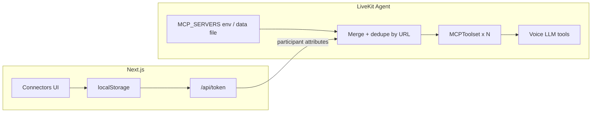

# MCP Connectors + Echo Branding — Design

**Date:** 2026-07-30  
**Status:** Approved (approach C, phase 1)  
**Branch:** `cursor/fresh-vision-frames` (or new feature branch at implementation time)

## Goal

1. Let Echo load external MCP tools without code changes per connector.
2. Support **admin defaults** (agent env) plus **per-user extras** (frontend UI → session).
3. Remove user-visible LiveKit branding from the web UI (keep SDKs).

## Context

- Agent: LiveKit Agents Python on LiveKit Cloud (`echo-agent`).
- Web: Next.js on Vercel; token via `/api/token`.
- Existing tools: notes, time, Tavily search (on Agent); vision via OpenRouter.
- LiveKit example: `mcp.MCPToolset` + `mcp.MCPServerHTTP` on `AgentSession.tools`.
- Optional dep required: `livekit-agents[mcp]` (installs `mcp` package).
- Vercel FS is read-only — admin cannot persist secrets via file write in production (same pattern as Tavily).

## Decisions

| Topic | Choice |
| --- | --- |
| Approach | **C phase 1** — env admin defaults + per-user localStorage extras |
| Transport of user MCP | Participant JWT **attributes** set by `/api/token` |
| Admin defaults storage | `MCP_SERVERS` env JSON; local fallback `agent/data/mcp_servers.json` |
| Auth for user connectors | None (personal MVP); keys live in browser localStorage — documented risk |
| Branding | Replace LiveKit logos/links/copy with Echo; keep `@livekit/*` packages |

## Architecture



### 1. Shared connector schema

Same shape for admin env and user extras:

```json
{
  "id": "weather",
  "name": "Weather",
  "url": "https://example.com/sse",
  "enabled": true,
  "headers": { "Authorization": "Bearer ..." }
}
```

Rules:

- `url` required; must be `http://` or `https://` (SSE/streamable HTTP MCP).
- `enabled: false` → skipped.
- Max **10** user connectors; attribute payload capped (~8KB) — reject oversize at token mint.
- Merge order: admin defaults first, then user extras; **same URL** → user entry wins.
- Stdio MCP servers are out of scope for phase 1 (Cloud-hostile).

### 2. Agent changes

**Dependency:** add `mcp` extra to `livekit-agents` in `pyproject.toml`  
(`livekit-agents[openai,deepgram,cartesia,mcp]`).

**New module** `agent/src/mcp_config.py`:

- `load_admin_mcp_servers() -> list[McpServerConfig]`  
  - Parse `MCP_SERVERS` env (JSON array), else `data/mcp_servers.json` if present.
- `parse_user_mcp_servers(attributes: dict) -> list[McpServerConfig]`  
  - Read attribute key `echo_mcp_servers` (JSON string).
- `merge_mcp_servers(admin, user) -> list[McpServerConfig]`
- `build_mcp_toolsets(servers) -> list[MCPToolset]`  
  - One `mcp.MCPToolset(id=..., mcp_server=mcp.MCPServerHTTP(url=..., headers=...))` per enabled server.
  - Connection failures: log warning, omit that toolset (do not fail session start).

**Wire-up** (preferred sequence in `agent.py`):

1. `build_session()` creates STT/LLM/TTS **without** MCP tools (admin+user MCP need room context).
2. `await ctx.connect()` so the user’s JWT attributes are visible on the remote participant.
3. Merge admin + user MCP configs; build `MCPToolset` list.
4. `await session.start(..., )` with MCP toolsets on the session **or** start first then `update_tools` if the installed Agents API requires start-before-tools — pick the pattern that matches the installed `livekit-agents` version during implementation.
5. Built-in tools stay on `PersonalAssistant` (notes/time/search).

**Participant attributes:** set on the access token (`echo_mcp_servers`) so they exist at join. Do not rely on post-join attribute updates in phase 1.

**Instructions:** add a short Vision/Tools blurb:

- External MCP tools may be available; use them when they match the user request; do not invent tool results.

**Env docs:** update `agent/.env.example` with `MCP_SERVERS=` commented example.

### 3. Web — token path for user MCP

Extend `POST /api/token` body:

```json
{
  "room_config": { "agents": [...] },
  "mcp_servers": [ { "id", "name", "url", "enabled", "headers?" } ]
}
```

- Validate/sanitize (URL scheme, max count, max JSON size).
- Set LiveKit AccessToken **attributes**:  
  `echo_mcp_servers` = JSON string of enabled servers only.
- Never log header values.

**Client:** custom `TokenSource` (or endpoint options) that:

1. Reads connectors from localStorage.
2. POSTs them with the token request.

### 4. Web — Connectors UI

- New panel accessible from welcome view and/or settings (gear): **MCP Connectors**.
- CRUD: name, URL, optional `Authorization` (or freeform header key/value), enabled toggle, delete.
- Persist under key `echo.mcp_servers` in `localStorage`.
- Short warning: credentials stay in this browser; for personal use only.
- Empty state explains admin defaults still work without any user connectors.

### 5. Admin panel

- New section on `/admin`: **MCP defaults**.
- Explain production uses LiveKit secret `MCP_SERVERS`.
- Show example JSON + suggested CLI:  
  `lk agent update-secrets --secrets-file ...` / paste example.
- Local-only: if `agent/data/mcp_servers.json` is writable, allow save (same limitation narrative as Tavily on Vercel).

### 6. Branding removal (frontend only)

| Location | Change |
| --- | --- |
| `web/app/layout.tsx` | Header: Echo mark/text, no livekit.io link; remove “Built with LiveKit Agents” |
| `web/components/app/welcome-view.tsx` | Remove bottom “Built with LiveKit Agents”; soften/remove `lk agent dev` tip or keep as optional local tip without LiveKit brand |
| `web/app-config.ts` | Echo description; logos → `/echo-logo.svg` (and dark variant) |
| `web/app/opengraph-image.tsx` | Stop using `lk-logo` / `lk-wordmark` |
| `web/public/` | Add simple Echo SVG mark; stop shipping LiveKit logos as the product identity (files may remain unused) |

Do **not** rename LiveKit SDK imports, CSS `data-lk-*` hooks, or admin copy that explains LiveKit **secrets** as an ops detail (that’s operational, not product branding). Soften admin “LiveKit” mentions only where it’s marketing; keep accurate deploy instructions.

## Scope

**In scope**

- MCP HTTP/SSE connectors via env + user UI.
- Token attribute plumbing.
- Branding cleanup.
- Docs in `.env.example` / admin hints.

**Out of scope (phase 2+)**

- Cloud DB/KV for admin CRUD and synced user configs.
- OAuth / Cursor marketplace catalog.
- Stdio MCP on Cloud.
- Multi-user accounts / encrypted vault for API keys.
- Hot-reload of admin env without agent redeploy/secret update.

## Error handling

| Case | Behavior |
| --- | --- |
| Invalid user MCP JSON / oversize | Token API 400; UI toast |
| MCP server unreachable | Skip toolset; log; session continues |
| No MCP configured | Normal session; existing tools only |
| Missing `mcp` extra | Fail fast at import with clear log/install hint |

## Testing

- [ ] No MCP env / no user list → agent starts; notes/time still work.
- [ ] Admin `MCP_SERVERS` only → tools appear; voice can invoke.
- [ ] User connector only (localStorage → token attrs) → tools appear for that session.
- [ ] Same URL in admin + user → user headers/name win.
- [ ] Bad URL / dead server → session still joins; other tools work.
- [ ] Hard refresh: no LiveKit logo or “Built with LiveKit” on welcome/header.
- [ ] Camera/screen vision regression: still works with preemptive generation off.

## Security notes

- User MCP headers in localStorage and JWT attributes are visible to the room participants (user + agent). Acceptable for personal MVP; document clearly.
- Do not put admin MCP secrets in the Next.js public bundle.
- Prefer HTTPS MCP URLs in production.
